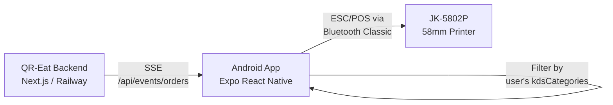
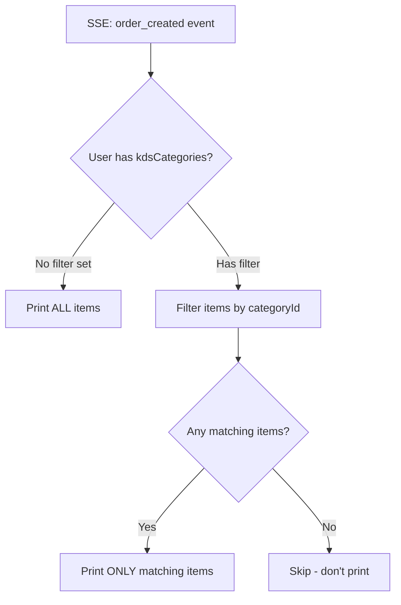

# KDS Kitchen Printer — Expo React Native Android App

## Goal

Build an Android app that receives real-time orders via SSE from QR-Eat backend and auto-prints **filtered** kitchen tickets to a 58mm Bluetooth thermal printer (JK-5802P). The app also displays the KDS board UI.

---

## Architecture Overview



### Order-to-Print Flow (~1-2 seconds)

```
Customer places order → PostgreSQL NOTIFY → SSE push → App receives event
    → Filter items by logged-in user's kdsCategories
    → If matching items exist → Format ESC/POS → Send to Bluetooth printer
    → Ticket prints in kitchen
```

---

## Key Decisions

### ✅ Confirmed by User
| Decision | Choice |
|---|---|
| Project structure | **Separate project** `qr-eat-kds/` |
| Printer | **58mm JK-5802P** Bluetooth |
| App behavior | **Option B**: KDS board UI + auto-print |
| SSE reuse | Yes — existing [/api/events/orders](file:///home/atiff/Desktop/QR-Eat/src/app/api/events/orders) endpoint |

### Dev Build Explained

> [!NOTE]
> **What is a Dev Build?**
>
> Normally, you develop Expo apps using **Expo Go** — a pre-built app you download from Play Store that runs your code. But Expo Go only supports a fixed set of APIs.
>
> **Bluetooth Classic** (needed for the JK-5802P) requires a **native Android module** (`react-native-bluetooth-escpos-printer`) that isn't included in Expo Go.
>
> A **Dev Build** means Expo creates a **custom APK** that includes the Bluetooth module. You install this APK on your Android device instead of Expo Go. It works exactly the same for development — hot reload, console logs, etc. — it just has extra capabilities.
>
> **In practice:**
> ```bash
> npx expo prebuild          # Generates Android project files
> npx expo run:android       # Builds & installs custom dev APK
> ```
> After this, development is identical to Expo Go. When ready for production, you build a release APK/AAB with `eas build`.

---

## Station Filter → Print Filter (Critical Feature)

### How it works today (Web KDS)

Each kitchen staff user has `kdsCategories` saved in their [preferences](file:///home/atiff/Desktop/QR-Eat/src/app/api/staff/preferences) JSON field:

```
Staff.preferences = { "kdsCategories": ["cat-drinks-id", "cat-desserts-id"] }
```

The web KDS ([KitchenDisplayBoard.tsx](file:///home/atiff/Desktop/QR-Eat/src/components/kitchen/KitchenDisplayBoard.tsx)) filters client-side:
```typescript
// Line 345-348 of KitchenDisplayBoard.tsx
if (selectedCategories.length === 0) return order; // Show all if none selected
const filteredItems = order.items.filter(item =>
    selectedCategories.includes(item.menuItem.categoryId)
);
```

### How the Android app will handle it



**Example:** Kitchen A logs in with filter = `[Drinks, Desserts]`
- Order comes in: 2x Nasi Lemak, 1x Teh Tarik, 1x Ice Cream
- App filters → only prints: **1x Teh Tarik**, **1x Ice Cream**
- The Nasi Lemak goes to Kitchen B's printer (who filters for Food)

---

## Kitchen Receipt Format (58mm / 32 chars wide)

No prices — focused on chef/waiter readability:

```
================================
     ** KITCHEN ORDER **
================================
#001              Table: A5
12/02/2026         14:30
--------------------------------

2x Nasi Lemak
   + Extra Sambal
   + Telur Mata
   >> Less spicy please

1x Teh Tarik
   + Kurang Manis

================================
     STATION: DRINKS
================================

[auto-cut]
```

Key design choices:
- **Large order number** for quick visual scan
- **No prices** — kitchen doesn't need them
- **Special instructions** highlighted with `>>`
- **Station name** at bottom for routing clarity
- **Item options/variations** shown indented with `+`

---

## Tech Stack

| Layer | Technology |
|---|---|
| Framework | Expo SDK 52+ with **Dev Build** |
| Navigation | Expo Router |
| SSE | `react-native-sse` |
| Bluetooth | `react-native-bluetooth-escpos-printer` |
| State | Zustand + AsyncStorage |
| Auth | JWT token (new endpoint needed) |
| Background | Expo TaskManager + Foreground Service |

---

## App Structure

```
qr-eat-kds/
├── app/
│   ├── _layout.tsx              # Providers (auth, printer, SSE)
│   ├── index.tsx                # Login screen
│   ├── settings.tsx             # Printer pairing + station filter
│   └── kitchen/
│       └── index.tsx            # KDS board + auto-print
├── src/
│   ├── services/
│   │   ├── sse-service.ts       # SSE connection + reconnection
│   │   ├── print-service.ts     # Bluetooth send + queue
│   │   ├── auth-service.ts      # Login + token storage
│   │   └── escpos-formatter.ts  # Order → 58mm ESC/POS commands
│   ├── stores/
│   │   ├── order-store.ts       # Orders + filter state
│   │   ├── printer-store.ts     # BT connection state
│   │   └── settings-store.ts    # Server URL, auto-print toggle
│   ├── components/
│   │   ├── OrderCard.tsx
│   │   ├── PrinterStatus.tsx
│   │   └── StationFilter.tsx    # Category filter (same as web)
│   └── types/
│       └── order.ts             # Shared types
├── app.json
└── package.json
```

---

## Backend Changes Needed (Minimal)

### 1. [NEW] Mobile Login Endpoint
`src/app/api/auth/mobile/route.ts`

```typescript
// POST /api/auth/mobile
// Body: { username, password }
// Returns: { token, user: { id, name, restaurantId, preferences } }
```

Returns JWT token + user preferences (including `kdsCategories`) so the app knows the filter on login.

### 2. [MODIFY] SSE Endpoint — Accept Token
[src/app/api/events/orders/route.ts](file:///home/atiff/Desktop/QR-Eat/src/app/api/events/orders/route.ts)

Accept `?token=<jwt>` query param for mobile SSE (EventSource doesn't support custom headers).

### 3. [MODIFY] Kitchen Orders API — Accept Token
[src/app/api/kitchen/orders/route.ts](file:///home/atiff/Desktop/QR-Eat/src/app/api/kitchen/orders/route.ts)

Same pattern for initial data fetch.

---

## Print Queue & Reliability

```typescript
// Orders persist to AsyncStorage — never lost
interface PrintQueue {
  pending: PrintJob[];      // Waiting for printer
  printing: PrintJob[];     // Being sent to BT
  completed: PrintJob[];    // Last 100 successful
  failed: PrintJob[];       // Failed after 3 retries
}
```

- Printer disconnects → orders queue locally
- Printer reconnects → queued orders print automatically
- App restart → pending queue restored from AsyncStorage
- Failed orders → visible in UI for manual reprint

---

## Implementation Phases

### Phase 1: Foundation (Week 1)
- [ ] Initialize Expo project with dev build
- [ ] Login screen + JWT auth
- [ ] SSE connection service with reconnection
- [ ] KDS board UI (orders display)
- [ ] Station filter (fetch + apply kdsCategories)

### Phase 2: Bluetooth Printing (Week 2)
- [ ] Bluetooth scanner + pairing settings screen
- [ ] ESC/POS formatter for 58mm JK-5802P
- [ ] Print queue with retry logic
- [ ] Auto-print on filtered order received
- [ ] Reprint button on order cards

### Phase 3: Production Hardening (Week 3)
- [ ] Background foreground service (keep SSE alive)
- [ ] AsyncStorage queue persistence
- [ ] Sound alert on new order
- [ ] Settings screen (server URL, auto-print toggle, print test)
- [ ] Build release APK

---

## Verification Plan

### Manual Tests
1. **Login** → verify JWT token received, preferences loaded
2. **SSE** → place order from customer QR → verify order appears in app < 1s
3. **Filter** → set filter to "Drinks" → verify only drink items shown/printed
4. **Print** → verify 58mm receipt format on JK-5802P
5. **Queue** → disconnect printer → place order → reconnect → verify queued order prints
6. **Background** → lock screen → place order → verify it prints
7. **Multi-station** → 2 devices, different filters → verify each prints only their items
